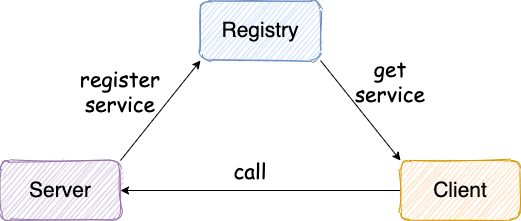
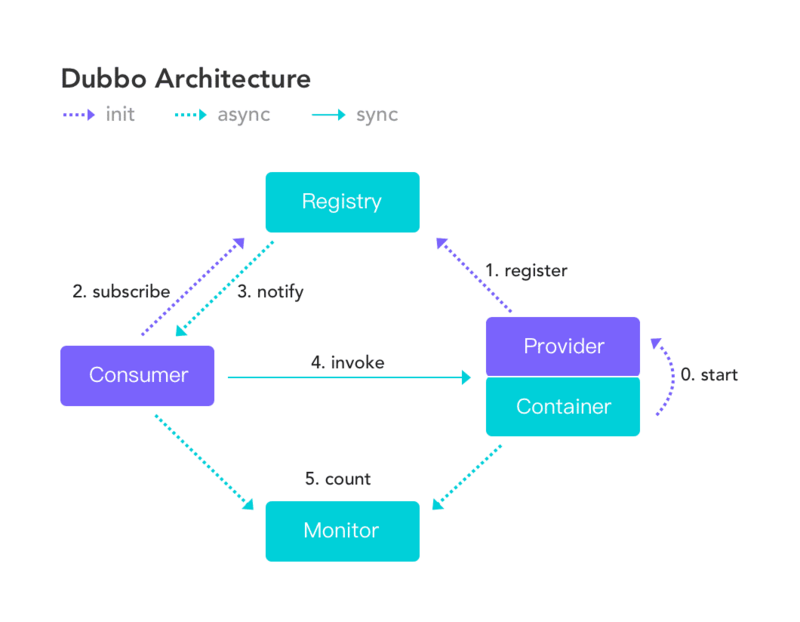
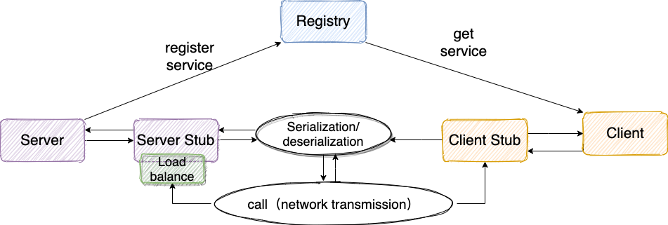

# guide-rpc-framework

## Preface

Although the principle of RPC is not difficult, I encountered many problems in the process of implementation. [guide-rpc-framework](https://github.com/Snailclimb/guide-rpc-framework)  implements only the most basic features of the RPC framework, and some of the optimizations are mentioned below for those interested.

With this simple wheel, you can learn the underlying principles and principles of RPC  framework as well as various Java coding practices.

You can even use the  [guide-rpc-framework](https://github.com/Snailclimb/guide-rpc-framework)  as a choice for your graduation/project experience, which is very great! Compared to other job seekers whose project experience is based on a variety of systems, building wheels is a sure way to win an interviewer's favor.

If you're going to use the  [guide-rpc-framework](https://github.com/Snailclimb/guide-rpc-framework)  as your graduation/project experience, I want you to understand it rather than just copy and paste my ideas. You can fork my project and then optimize it. If you think the optimization is valuable, you can submit PR to me, and I will deal with it as soon as possible.

##  Introduction

 [guide-rpc-framework](https://github.com/Snailclimb/guide-rpc-framework) is an RPC framework based on Netty+Kyro+Zookeeper. Detailed code comments, clear structure, and integrated Check Style specification code structure make it ideal for reading and learning.

Due to the limited energy and ability of me, if you think there is something to be improved and perfected, welcome to fork this project, then clone it to local, and submit PR to me after local modification, I will Review your code as soon as possible.

Let's start with a basic RPC framework design idea!

### A basic implementation of a RPC framework

> **note** ：The RPC framework we mentioned here refers to a framework that allows clients to directly call server-side methods as simple as calling local methods, similar to the Dubbo, Motan, and gRPC I introduced earlier. If you need to deal with the HTTP protocol, parse and encapsulate HTTP requests and responses. Type frameworks are not considered "RPC frameworks", such as Feign.

A schematic diagram of the simplest RPC framework usage is shown in the figure below, which is also the current architecture of [guide-rpc-framework](https://github.com/Snailclimb/guide-rpc-framework):

The service provider Server registers the service with the registry, and the service consumer Client gets the service-related information through the registry, and then requests the service provider Server through the network.

As a leader in the field of RPC framework [Dubbo](https://github.com/apache/dubbo), the architecture is shown in the figure below, which is roughly the same as what we drew above.

**Under normal circumstances, the RPC framework must not only provide service discovery functions, but also provide load balancing, fault tolerance and other functions. Such an RPC framework is truly qualified. ** 

**Please let me simply talk about the idea of designing a most basic RPC framework:**

1. **Registration Center**: The registration center is required first, and Zookeeper is recommended. The registration center is responsible for the registration and search of service addresses, which is equivalent to a directory service. When the server starts, the service name and its corresponding address (ip+port) are registered in the registry, and the service consumer finds the corresponding service address according to the service name. With the service address, the service consumer can request the server through the network.
2. **Network Transmission**: Since you want to call a remote method, you must send a request. The request must at least include the class name, method name, and related parameters you call! Recommend the Netty framework based on NIO.
3. **Serialization**: Since network transmission is involved, serialization must be involved. You can't directly use the serialization that comes with JDK! The serialization that comes with the JDK is inefficient and has security vulnerabilities. Therefore, you have to consider which serialization protocol to use. The more commonly used ones are hession2, kyro, and protostuff.
4. **Dynamic Proxy**: In addition, a dynamic proxy is also required. Because the main purpose of RPC is to allow us to call remote methods as easy as calling local methods, the use of dynamic proxy can shield the details of remote method calls such as network transmission. That is to say, when you call a remote method, the network request will actually be transmitted through the proxy object. Otherwise, how could it be possible to call the remote method directly?
2. **Load Balancing**: Load balancing is also required. Why? For example, a certain service in our system has very high traffic. We deploy this service on multiple servers. When a client initiates a request, multiple servers can handle the request. Then, how to correctly select the server that processes the request is critical. If you need one server to handle requests for the service, the meaning of deploying the service on multiple servers no longer exists. Load balancing is to avoid a single server responding to the same request, which is likely to cause server downtime, crashes and other problems. We can clearly feel its meaning from the four words of load balancing.