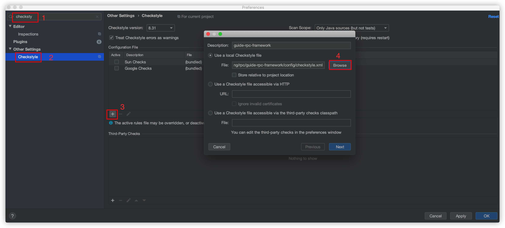
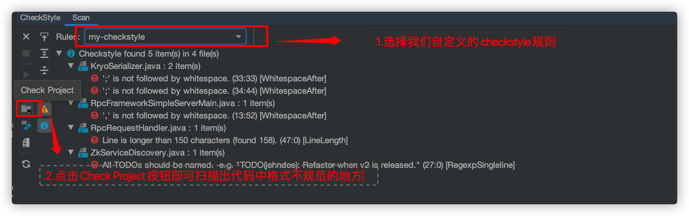

# guide-rpc-framework

本着开源精神，本项目README已经同步了英文版本。另外，项目的源代码的注释大部分也修改为了英文。

如访问速度不佳，可放在 Gitee 地址：https://gitee.com/SnailClimb/guide-rpc-framework 。如果要提交 issue 或者 pr 的话，请在 Github 提交：[https://github.com/Snailclimb/guide-rpc-framework](https://github.com/Snailclimb/guide-rpc-framework) 。

## 前言

虽说 RPC 的原理实际不难，但是，自己在实现的过程中自己也遇到了很多问题。[guide-rpc-framework](https://github.com/Snailclimb/guide-rpc-framework) 目前只实现了 RPC 框架最基本的功能，一些可优化点都在下面提到了，有兴趣的小伙伴可以自行完善。

通过这个简易的轮子，你可以学到 RPC 的底层原理和原理以及各种 Java 编码实践的运用。

你甚至可以把 [guide-rpc-framework](https://github.com/Snailclimb/guide-rpc-framework) 当做你的毕设/项目经验的选择，这是非常不错！对比其他求职者的项目经验都是各种系统，造轮子肯定是更加能赢得面试官的青睐。

如果你要将 [guide-rpc-framework](https://github.com/Snailclimb/guide-rpc-framework) 当做你的毕设/项目经验的话，我希望你一定要搞懂，而不是直接复制粘贴我的思想。你可以 fork 我的项目，然后进行优化。如果你觉得的优化是有价值的话，你可以提交 PR 给我，我会尽快处理。

## 介绍

 [guide-rpc-framework](https://github.com/Snailclimb/guide-rpc-framework) 是一款基于 Netty+Kyro+Zookeeper 实现的 RPC 框架。代码注释详细，结构清晰，并且集成了 Check Style 规范代码结构，非常适合阅读和学习。

由于 Guide哥自身精力和能力有限，如果大家觉得有需要改进和完善的地方的话，欢迎 fork 本项目，然后 clone 到本地，在本地修改后提交 PR 给我，我会在第一时间 Review 你的代码。

**我们先从一个基本的 RPC 框架设计思路说起！**

### 一个基本的 RPC 框架设计思路

> **注意** ：我们这里说的 RPC 框架指的是：可以让客户端直接调用服务端方法就像调用本地方法一样简单的框架，比如我前面介绍的 Dubbo、Motan、gRPC 这些。 如果需要和 HTTP 协议打交道，解析和封装 HTTP 请求和响应。这类框架并不能算是“RPC 框架”，比如 Feign。

一个最简单的 RPC 框架使用示意图如下图所示,这也是 [guide-rpc-framework](https://github.com/Snailclimb/guide-rpc-framework) 目前的架构 ：


服务提供端 Server 向注册中心注册服务，服务消费者 Client 通过注册中心拿到服务相关信息，然后再通过网络请求服务提供端 Server。

作为 RPC 框架领域的佼佼者[Dubbo](https://github.com/apache/dubbo)的架构如下图所示,和我们上面画的大体也是差不多的。


**一般情况下， RPC 框架不仅要提供服务发现功能，还要提供负载均衡、容错等功能，这样的 RPC 框架才算真正合格的。**

**简单说一下设计一个最基本的 RPC 框架的思路：**


1. **注册中心** ：注册中心首先是要有的，推荐使用 Zookeeper。注册中心负责服务地址的注册与查找，相当于目录服务。服务端启动的时候将服务名称及其对应的地址(ip+port)注册到注册中心，服务消费端根据服务名称找到对应的服务地址。有了服务地址之后，服务消费端就可以通过网络请求服务端了。
2. **网络传输** ：既然要调用远程的方法就要发请求，请求中至少要包含你调用的类名、方法名以及相关参数吧！推荐基于 NIO 的 Netty 框架。
3. **序列化** ：既然涉及到网络传输就一定涉及到序列化，你不可能直接使用 JDK 自带的序列化吧！JDK 自带的序列化效率低并且有安全漏洞。 所以，你还要考虑使用哪种序列化协议，比较常用的有 hession2、kyro、protostuff。
4. **动态代理** ： 另外，动态代理也是需要的。因为 RPC 的主要目的就是让我们调用远程方法像调用本地方法一样简单，使用动态代理可以屏蔽远程方法调用的细节比如网络传输。也就是说当你调用远程方法的时候，实际会通过代理对象来传输网络请求，不然的话，怎么可能直接就调用到远程方法呢？
5. **负载均衡** ：负载均衡也是需要的。为啥？举个例子我们的系统中的某个服务的访问量特别大，我们将这个服务部署在了多台服务器上，当客户端发起请求的时候，多台服务器都可以处理这个请求。那么，如何正确选择处理该请求的服务器就很关键。假如，你就要一台服务器来处理该服务的请求，那该服务部署在多台服务器的意义就不复存在了。负载均衡就是为了避免单个服务器响应同一请求，容易造成服务器宕机、崩溃等问题，我们从负载均衡的这四个字就能明显感受到它的意义。
6. ......

### 项目基本情况和可优化点

为了循序渐进，最初的是时候，我是基于传统的 **BIO** 的方式 **Socket** 进行网络传输，然后利用 **JDK 自带的序列化机制** 以及内存直接存储相关服务相关信息来实现这个 RPC 框架的。

后面，我对原始版本进行了优化，已完成的优化点和可以完成的优化点我都列在了下面 👇。

**为什么要把可优化点列出来？** 主要是想给哪些希望优化这个 RPC 框架的小伙伴一点思路。欢迎大家 Clone 本仓库，然后自己进行优化。

- [x] **使用 Netty（基于 NIO）替代 BIO 实现网络传输；**
- [x] **使用开源的序列化机制 Kyro（也可以用其它的）替代 JDK 自带的序列化机制；**
- [x] **使用 Zookeeper 管理相关服务地址信息**
- [x] Netty 重用 Channel 避免重复连接服务端
- [x] 使用 `CompletableFuture` 包装接受客户端返回结果（之前的实现是通过 `AttributeMap` 绑定到 Channel 上实现的） 详见：[使用 CompletableFuture 优化接受服务提供端返回结果](./docs/使用CompletableFuture优化接受服务提供端返回结果.md)
- [x] **增加 Netty 心跳机制** : 保证客户端和服务端的连接不被断掉，避免重连。
- [x] **客户端调用远程服务的时候进行负载均衡** ：调用服务的时候，从很多服务地址中根据相应的负载均衡算法选取一个服务地址。ps：目前只实现了随机负载均衡算法。
- [x] **处理一个接口有多个实现的情况** ：对服务分组，发布服务的时候增加一个 group 参数即可。
- [x] **集成 Spring 通过注解注册服务**
- [x] **增加服务版本号** ：建议使用两位数字版本，如：1.0，通常在接口不兼容时版本号才需要升级。为什么要增加服务版本号？为后续不兼容升级提供可能，比如服务接口增加方法，或服务模型增加字段，可向后兼容，删除方法或删除字段，将不兼容，枚举类型新增字段也不兼容，需通过变更版本号升级。
- [ ] **对 SPI 机制的运用** 
- [ ] **增加可配置比如序列化方式、注册中心的实现方式,避免硬编码** ：通过 API 配置，后续集成 Spring 的话建议使用配置文件的方式进行配置
- [ ] **使用注解进行服务消费**
- [ ] **客户端与服务端通信协议（数据包结构）重新设计** ，可以将原有的 `RpcRequest`和 `RpcReuqest` 对象作为消息体，然后增加如下字段（可以参考：《Netty 入门实战小册》和 Dubbo 框架对这块的设计）：
  - **魔数** ： 通常是 4 个字节。这个魔数主要是为了筛选来到服务端的数据包，有了这个魔数之后，服务端首先取出前面四个字节进行比对，能够在第一时间识别出这个数据包并非是遵循自定义协议的，也就是无效数据包，为了安全考虑可以直接关闭连接以节省资源。
  - **序列化器编号** ：标识序列化的方式，比如是使用 Java 自带的序列化，还是 json，kyro 等序列化方式。
  - **消息体长度** ： 运行时计算出来。
  - ......
- [ ] **编写测试为重构代码提供信心**

### 项目模块概览


## 运行项目

### 导入项目

fork 项目到自己的仓库，然后克隆项目到自己的本地：`git clone git@github.com:username/guide-rpc-framework.git`，使用 IDEA 打开，等待项目初始化完成。

### 初始化 git hooks

**这一步主要是为了在 commit 代码之前，跑 Check Style，保证代码格式没问题，如果有问题的话就不能提交。**

> 以下演示的是 Mac/Linux 对应的操作，Window 用户需要手动将 `config/git-hooks` 目录下的`pre-commit` 文件拷贝到 项目下的 `.git/hooks/` 目录。

执行下面这些命令：

```shell
➜  guide-rpc-framework git:(master) ✗ chmod +x ./init.sh
➜  guide-rpc-framework git:(master) ✗ ./init.sh
```

`init.sh` 这个脚本的主要作用是将 git commit 钩子拷贝到项目下的 `.git/hooks/` 目录，这样你每次 commit 的时候就会执行了。

### CheckStyle 插件下载和配置

IntelliJ IDEA-> Preferences->Plugins->搜索下载 CheckStyle 插件，然后按照如下方式进行配置。



配置完成之后，按照如下方式使用这个插件！



### 下载运行 zookeeper

这里使用 Docker 来下载安装。

下载：

```shell
docker pull zookeeper:3.4.14
```

运行：

```shell
docker run -d --name zookeeper -p 2181:2181 zookeeper:3.4.14
```

## 使用

### 服务提供端

实现接口：

```java
public class HelloServiceImpl implements HelloService {
   @Override
    public String hello(Hello hello) {
      ......
    }
}
```

发布服务(使用 Netty 进行传输)：

```java
HelloService helloService = new HelloServiceImpl();
NettyServer nettyServer = new NettyServer("127.0.0.1", 9999);
nettyServer.publishService(helloService, HelloService.class);
```

### 服务消费端

```java
ClientTransport rpcClient = new NettyClientTransport();
RpcClientProxy rpcClientProxy = new RpcClientProxy(rpcClient);
HelloService helloService = rpcClientProxy.getProxy(HelloService.class);
String hello = helloService.hello(new Hello("111", "222"));
```

## 相关问题

### 为什么要造这个轮子？Dubbo 不香么？

写这个 RPC 框架主要是为了通过造轮子的方式来学习，检验自己对于自己所掌握的知识的运用。

实现一个简单的 RPC 框架实际是比较容易的，不过，相比于手写 AOP 和 IoC 还是要难一点点，前提是你搞懂了 RPC 的基本原理。

我之前从理论层面在我的知识星球分享过如何实现一个 RPC。不过理论层面的东西只是支撑，你看懂了理论可能只能糊弄住面试官。咱程序员这一行还是最需要动手能力，即使你是架构师级别的人物。当你动手去实践某个东西，将理论付诸实践的时候，你就会发现有很多坑等着你。

大家在实际项目上还是要尽量少造轮子，有优秀的框架之后尽量就去用，Dubbo 在各个方面做的都比较好和完善。

### 如果我要自己写的话，需要提前了解哪些知识

**Java** ：

1. 动态代理机制；
2. 序列化机制以及各种序列化框架的对比，比如 hession2、kyro、protostuff。
3. 线程池的使用；
4. `CompletableFuture` 的使用
5. ......

**Netty** ：

1. 使用 Netty 进行网络传输；
2. `ByteBuf` 介绍
3. Netty 粘包拆包
4. Netty 长连接和心跳机制

**Zookeeper** :

1. 基本概念；
2. 数据结构；
3. 如何使用 Netflix 公司开源的 zookeeper 客户端框架 Curator 进行增删改查；

## 教程

Guide 的星球正在更新《从零开始手把手教你实现一个简单的 RPC 框架》。扫描下方二维码关注“**JavaGuide**”后回复 “**星球**”即可。


