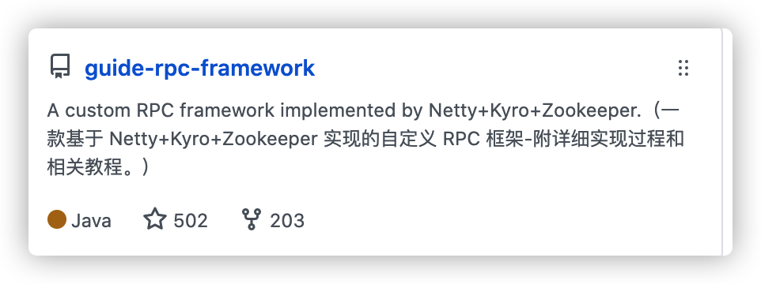
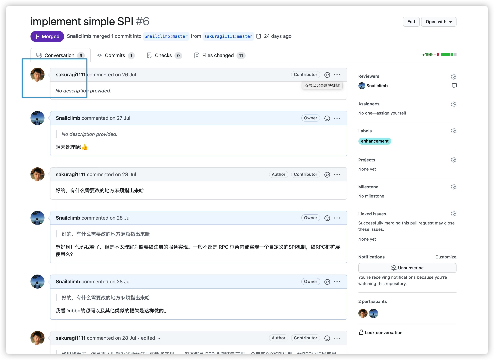
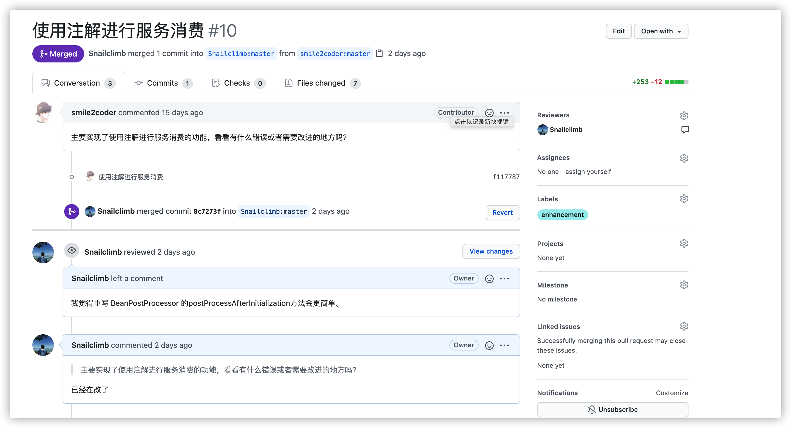
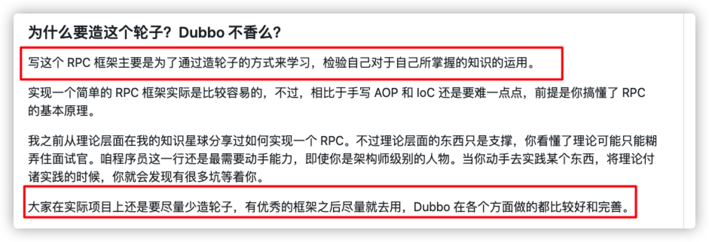
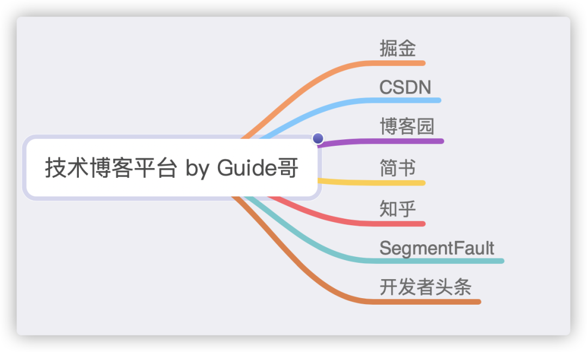

前段时间利用业余时间写了一个简单的 RPC 框架，花费了不少精力。开源出来之后，少部分不太友好的技术人站在上帝视角说了风凉话。就很难受，兄弟，谁还没有一个玻璃心。

简单吐槽一波，给大家聊聊关于  [guide-rpc-framework](https://github.com/Snailclimb/guide-rpc-framework) 的一些事情。

## 01 我的自定义 RPC 框架近况

关注我的大部分小伙伴应该都知道，3个月前，我利用业余时间手写一个简单的 RPC 框架（*玩具*），名字叫做 guide-rpc-framework。

目前的话，这个项目已经有 0.5k 的 star。感谢小伙伴们的支持！

**写这个 RPC 框架的主要目的是为了个人学习，开源出来的目的主要是想帮助到更多人。**

## 02 开源的魅力

开源出来之后，大部小伙伴都是比较支持的，有很多小伙伴都参与了进来一起完善。

这里点名表扬一下Github用户名为 **[sakuragi1111](https://github.com/sakuragi1111)**  和 **[smile2coder](https://github.com/smile2coder)**  这两位老哥。

sakuragi1111 这位老哥通过参考 Dubbo 源码实现了 SPI 机制。

[smile2coder](https://github.com/smile2coder) 这位老哥为  [guide-rpc-framework](https://github.com/Snailclimb/guide-rpc-framework) 添加了通过注解实现服务消费的功能。

目前的话， **[guide-rpc-framework](https://github.com/Snailclimb/guide-rpc-framework) 已经支持通过注解进行服务消费和注册。**

程序世界，什么样的人都有，有人感谢你，也会有人贬低你。

## 03 不那么好的声音

在我的 [guide-rpc-framework](https://github.com/Snailclimb/guide-rpc-framework)  开源之后，也经常会受到像：“你有本事别用现成的框架写一个啊？”、“你这个写的一点亮点都没有，有啥意思？”、“都有了 Dubbo 之后，为啥还要自己写一个？”、“重复造轮子没意义”......之类的不太友善的话语。

说句心里话，一般说出来这种话的人往往技术水平很低。

**如果，你指出我哪里写的不好，我很乐意地去修改。但是，你站在上帝视角说着风凉话，那就是人品有问题了。**

**1.为什么不能利用现成的框架呢？（比如为啥不用 JDK NIO 而用 Netty?）**

毫不夸张地说：**开源出来的东西，就是全体技术人共同的财富。**

Netty 比 NIO 更好用、更完善，我为啥还要直接使用 NIO呢？我们平常经常接触的 Dubbo、RocketMQ、Elasticsearch、gRPC 等等都用到了 Netty 啊。

**2.你这个写的一点亮点都没有，有啥意思？**

有能耐的话，你也可以自己写一个。说出此类的话的人，往往是有及其嫉妒心理的人。而且，RPC 框架本身就已经有很多比较成熟的例子了比如 Dubbo。说实话，Dubbo 基本是已近把 RPC 框架能考虑到的点都考虑到了。

我不信你一个人，能干过人家一个团队好多年的成果。

**3.都有了 Dubbo 之后，为啥还要自己写一个？**

**一定要学会看 README!!!** 

我在项目的 README  中明确说明了：**写这个 RPC 框架主要是为了通过造轮子的方式来学习，检验自己对于自己所掌握的知识的运用。**

**4.重复造轮子没意义**

**我们实际项目开发中是比较忌讳造轮子的，但是，实际学习过程中造轮子绝对是最自己百利而无一害的！** 

我的 RPC 框架肯定是无法和 Dubbo 这类已经这么成熟的相提并论。但是，在自己去写 RPC 框架的时候，更加加深了自己对于 RPC 框架的认识。实现的过程中，遇到了很多问题，解决问题的过程中也提高了自己的编程能力。总而言之，**造轮子是一种特别能够提高自己系统编程能力的手段。**

## 04 拥抱开源

**开源绝对是编程领域最美妙的事情之一，大幅提高了我们的生产力。**

没事就去开源社区比如 Github 或者 Gitee 逛逛，在这里你可以get到各种好东西。

你可以在 Github 分享很多东西，你的学习笔记、自己做的实战项目、自己造的轮子......（资源类的不太推荐，太容易侵权）。

虽然，现在 Github 被很多人单纯玩成了引流工具。但是，**整体来说 Github 整体技术环境和氛围还是很不错的！** 

另外，最好的话是要给项目弄一个英文版本，项目代码中的注释最好也要是英文的。毕竟是开源，最好是能准守开源精神使用世界通用语言（这一点我自己也没做好，反思！）。

如果你想让自己的开源项目被更多人知道的话，你可以在下面技术平台宣传（**不宣传的话，开源的东西很难被别人知道，不要让好东西被埋没**）：

